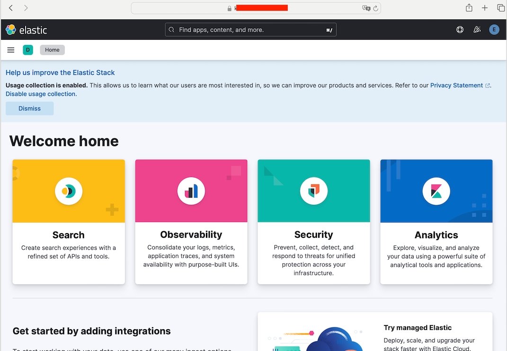

# 목차

- [소개](#소개)
- [es 8버전의 정책](#es-8버전의-정책)
- [글을 쓰게 된 이유](#글을-쓰게-된-이유)
- [필요 용어, 커맨드 정리](#필요-용어-커맨드-정리)
    - [https 용어 정리](#https-용어-정리)
    - [작업에 필요한 k8s 용어 ( 커맨드 )](#작업에-필요한-k8s-용어--커맨드-)
    - [그 외 도움이 되는 커맨드](#그-외-도움이-되는-커맨드)
- [결과물](#결과물)
    - [1. 인증, 볼륨 설정 없이 pod 띄울 때](#1-인증-볼륨-설정-없이-pod-띄울-때)
    - [2. 인증, 설정 적용된 statefuleset](#2-인증-설정-적용된-statefuleset)
    - [2. 인증, volume 정보 포함하여 pod 띄우기](#2-인증-volume-정보-포함하여-pod-띄우기)
- [공식문서](#공식문서)
    - [step 0: pod 진입하기](#step-0-pod-진입하기)
    - [step 1 : ca 등록 : elasticsearch-certutil 실행](#step-1--ca-등록--elasticsearch-certutil-실행)
    - [step 2 : certificate 파일, private key 생성](#step-2-certificate-파일-private-key-생성)
    - [step 3 : ca 등록](#step-3--ca-등록)
    - [step 4 : https 통신을 위한 pem 키 생성](#step-4-https-통신을-위한-pem-키-생성)
    - [step 5 : 세 파일 모두 노드로 옮기기](#step-5--세-파일-모두-노드로-옮기기)
    - [step 6: 세 파일 모두 secret 으로 만들기](#step-6-세-파일-모두-secret-으로-만들기)
    - [step 7 elasitcsearch config 등록하고 볼륨으로 마니페스트에 추가하기](#step-7-elasitcsearch-config-등록하고-볼륨으로-마니페스트에-추가하기)
    - [step 8 : kibana system 의 비밀번호 변경하기](#step-8--kibana-system-의-비밀번호-변경하기)
    - [step 9: kibana 마니패스트 만들기](#step-9-kibana-마니패스트-만들기)
    - [step 10: https 보안이 적용된 es 와 kibana 를 즐기기](#step-10-https-보안이-적용된-es-와-kibana-를-즐기기)

# 소개

es 8 버전 기준, kibana 와 es 의 통신은 자체 인증된 ca 에 의한 인증서로 보안된 https 통신이 보장되어야 합니다.
이 문서는 elasticsearch와 kibana 의 https 설정에 필요한 과정과 개념에 대해 설명합니다.

이후, k8s 리소스 상에서 single-node type 의 elasticsearch 와 kibana 를 https 통신으로 통신하는 예시를 보입니다.


## es 8버전의 정책

1. 8.13 버전기준, ***"elasticsearch security principles"* 공식문서**에서는 elasticsearch 의 https 통신을 꼭 하라고 명시해 있습니다.

2. 브라우저에서 kibana 를 향한 https 통신과 kibana 에서 es 를 통한 인증은 별개입니다.
   공식문서에서는 이 통신을 수립하는 과정을 설명하고 있습니다.

3. elasticsearch 의 인증 best practice 는 public 한 https, http 접근을 제한하는 것입니다.  Ip white list , 자체 서명한 ca 등으로 클라이언트를 제한할 수 있습니다. 공식문서의 예시는 자체 서명한 ca 를 통해서 접근을 제한합니다.

[공식문서]
링크 :https://www.elastic.co/guide/en/elasticsearch/reference/current/security-basic-setup-https.html

[es-community 문답]
링크: https://discuss.elastic.co/t/is-it-safe-to-expose-elasticsearch-to-the-internet/247041


## 글을 쓰게 된 이유

1. 자체 설정한 ca 의 개념이 많은 개발자분들에겐 생소할 수 있습니다.
    1. 생소한데 비해 ca 등록과 pem 생성, 기록까지의 과정이 너무 추상적으로 설명이 되어 있습니다.

2. k8s manifest 관련한 리소스의 부족
    1. bitnami helm 차트로 관리 시, 필요 리소스보다 많은 리소스가 요구되거나 직접 설정한 환경변수가 차트의 설정에 의해 덮어씌워 지는 경우가 있습니다.
    2. 직접 마니페스트를 구성하는 분들에게 만약에 보시면 도움이 되면 좋겠습니다.


# 필요 용어, 커맨드 정리

## https 용어 정리

### 1. ca :Certificate Authority
- https 통신 중 인증 기관의 역할
- https 통신 과정은 해당 링크 참고
    - 링크 : https://www.semrush.com/blog/what-is-https/
### 2. 자체 서명한 ca
- public 한 ca 말고 내부망이나 자체적인 인증에 사용되는 ca
- tls 인증을 위한 키를 직접 받지 못한 클라이언트는 https 통신에 실패한다. ( ssl_pass 같은 옵션예외)
### 3. http 인증서
- 위 링크의 설명 중, https 통신을 위해 클라이언트에게 전송되는 ca 인증서.
### 4. pem 파일
- 키값을 보관하기 위한 파일, 아래의 예시에서는 인증서를 해독하는데 필요한 키값이 포함됨 .


## 작업에 필요한 k8s 용어 ( 커맨드 )

### 1. kubectl cp

- https 관련한 설정을 유지하기 위해, 생성된 ca, p12, pem 파일을 컨트롤플레인으로 옮겨야 할 수 있습니다.
- 노드 내 파일시스템 <-> pod 내 파일시스템, 양 방향으로 똑같이 사용 가능하고, 파드 내 파일시스템에선 상대경로를 명시해야 합니다.

```shell
kubectl cp /path/to/local/file <namespace>/<pod-name>:path_in_pod/file
```

### 2.statefulset
- 고정 dns 주소와 리소스의 사용을 위해 deployment 보다는 statefulset의 마니페스트를 작성하기를 권장합니다.

```yml
apiVersion: apps/v1 
kind: StatefulSet 
metadata: 
	name: web 
	namespace: prod-es 
spec: 
	serviceName: "nginx" 
	replicas: 3
```

### 3. volumn
- elasticsearch/data 에 볼륨을 설정하여 파드의 재시작시에도 데이터, 유저정보가 유지되도록 합니다.


### 4. secret 과 configmap
- volume 과 같은 역할을 합니다. volumn은 디렉토리, secret과 config는 파일단위로 관리됩니다.
- base64 로 인코딩 되어서 가시성이 없어야 하는 자료들 ( 비밀번호, 주소, 키 값) 등은 secret 으로 관리합니다.
- elasticsearch.yml, kibana.yml 등 가시성이 있어야 좋은 config 값들은 configmap으로 설정합니다.

```yml

apiVersion: v1 
kind: Secret 
metadata: 
	name: my-secret 
	namespace: prod-es 
type: Opaque 
data: 
	username: dXNlcm5hbWU= # base64 인코딩된 값 
	password: cGFzc3dvcmQ= # base64 인코딩된 값
```

```yml
apiVersion: v1 
kind: ConfigMap 
metadata: 
	name: my-config 
	namespace: prod-es 
data: 
	config.properties: | 
		key1=value1 
		key2=value2
```


### 5. securityContext runAsUser, runAsGroup

- elasticsearch docker 이미지에서는 es 파일을 소유자, 그룹을  elasticsearch:elasticsearch 로 수행하게 되고 default id 는 1000 입니다.
- 만약 버전별로 elasticsearch 그룹의 id 가 1000 이 아니라면 파드 시작 시, 커맨드로 whoami 커맨드를 통해 id 를 확인 하세요.

```yml
spec:
	serviceName: elasticsearch
	replicas: 1
	selector:
		matchLabels:
			app: elasticsearch
		template:
			metadata:
				labels:
					app: elasticsearch
			spec:
				securityContext:
					runAsUser: 1000
					runAsGroup: 1000
					fsGroup: 1000
```

## 그 외 도움이 되는 커맨드

### 1. Pod shell 진입
```
kubectl exec -it <pod-name> -n <namespace> -- /bin/bash 
```

### 2. 컨테이너 로그 확인하기

- 가끔 pod 로그 없이 죽는 경우엔, container 로그를 확인하세요.

```
# 컨테이너 로그 확인 
$ kubectl logs -n <namespace> <pod-name> -c <container-name> 

# 파드 로그 
$ kubectl logs -n <namespace> <pod-name> 
```


### 3. curl 로 인증서 정보 확인하기 -v

- curl 에 -v 옵션을 추가함으로서 인증과정과 ca 관련정보를 출력할 수 있습니다.
- 디버깅 시에 도움이 되어 공유 드립니다.

```shell

 curl -v  -u <id>:<password> "https://xxx.com"
*   Trying xxx.xxx.xxx ...
* Connected to xxx\xxxx xxxx 443 (#0)
* ALPN: offers h2
* ALPN: offers http/1.1
*  CAfile: /xxx/xxx/xxx.pem
*  CApath: none
* TLSv1.3 (OUT), TLS handshake, Client hello (1):
* TLSv1.3 (IN), TLS handshake, Server hello (2):
* TLSv1.3 (IN), TLS handshake, Encrypted Extensions (8):
* TLSv1.3 (IN), TLS handshake, Certificate (11):
* TLSv1.3 (IN), TLS handshake, CERT verify (15):
* TLSv1.3 (IN), TLS handshake, Finished (20):
* TLSv1.3 (OUT), TLS change cipher, Change cipher spec (1):
* TLSv1.3 (OUT), TLS handshake, Finished (20):
* SSL connection using TLSv1.3 / TLS_AES_256_GCM_SHA384
* ALPN: server accepted h2
* Server certificate:
*  subject: CN=xxx.xxx
*  start date: Apr 22 09:54:15 2024 GMT
*  expire date: Jul 21 09:54:14 2024 GMT
*  subjectAltName: host xxx.xxx" matched cert's "*xxx.xxx"
*  issuer: C=US; O=xxx xxx xxx LLC; CN=GTS CA 1P5
*  SSL certificate verify ok.
* Using HTTP2, server supports multiplexing

```


### 4. base64 인코드

- secret 에 값을 입력하려면 base64 로 인코딩이 필수입니다.

```shell 
$ base64 elastic-stack-ca.p12 > elastic-stack-ca.p12.base64
```


## 결과물
### 1. 인증, 볼륨 설정 없이 pod 띄울 때,

```yml 
apiVersion: apps/v1
kind: StatefulSet
metadata:
  name: local-es
  namespace: prod-es
spec:
  serviceName: local-es
  replicas: 1
  selector:
    matchLabels:
      app: local-es
  template:
    metadata:
      labels:
        app: local-es
    spec:
      containers:
      - name: local-es
        image: docker.elastic.co/elasticsearch/elasticsearch:8.13.4
        ports:
        - containerPort: 9200
          name: es-http
        - containerPort: 9300
          name: es-internal
        env:
        - name: discovery.type
          value: single-node
```


### 2. 인증, 설정 적용된 statefuleset

```yml 
apiVersion: apps/v1
kind: StatefulSet
metadata:
  name: elasticsearch
  namespace: test-es
  
spec:
  serviceName: elasticsearch
  replicas: 1
  selector:
    matchLabels:
      app: elasticsearch
      
  template:
    metadata:
      labels:
        app: elasticsearch
        
    spec:
      securityContext:
        runAsUser: 1000
        runAsGroup: 1000
        fsGroup: 1000
        
      containers:
      - name: elasticsearch
        image: docker.elastic.co/elasticsearch/elasticsearch:8.13.4
        resources:
          limits:
            memory: 4Gi
            cpu: "4"
          requests:
            memory: 4Gi
            cpu: "4"
        ports:
        - containerPort: 9200
          name: es-http
        - containerPort: 9300
          name: es-internal
        env:
        - name: ELASTIC_PASSWORD
          valueFrom:
            secretKeyRef:
              name: elasticsearch-secret
              key: elastic-password
              
        volumeMounts:
        - name: es-storage
          mountPath: /usr/share/elasticsearch/data
        - name: config-volume
          mountPath: /usr/share/elasticsearch/config/elasticsearch.yml
          subPath: elasticsearch.yml
        - name: config-volume
          mountPath: /usr/share/elasticsearch/config/jvm.options
          subPath: jvm.options
        - name: elastic-certificates-p12
          mountPath: /usr/share/elasticsearch/config/certs
        - name: elastic-http-p12
          mountPath: /usr/share/elasticsearch/config/http
          
      volumes:
      - name: es-storage
        persistentVolumeClaim:
          claimName: prod-es-pvc
      - name: config-volume
        configMap:
          name: elasticsearch-config
      - name: elastic-certificates-p12
        secret:
          secretName: elastic-certificates-p12
      - name: elastic-ca-pem
        secret:
          secretName: elastic-ca-pem
      - name: elastic-http-p12
        secret:
          secretName: elastic-http-p12
          
      affinity:
        nodeAffinity:
          requiredDuringSchedulingIgnoredDuringExecution:
            nodeSelectorTerms:
            - matchExpressions:
              - key: node-app
                operator: In
                values:
                - "es"

```

### 2. 인증, volume 정보 포함하여 pod 띄우기

-> 각 secret, configmap 에 대한 설정은 아래의 step 별 정리에 있습니다. 

# 작업내용 step 별 정리 

### step 0: pod 진입하기.

1. pod 이름, 상태 확인하기
```
$ kubectl get all -n <namespace>
```

2. pod 진입하기
```
$ kubectl exec -it -n <namespace> <podname> -- /bin/bash  
```

## step 1 : ca 등록 : elasticsearch-certutil 실행

1.  Generate the certificate authority
2.  자체 인증된 ca 를 등록하는 커맨드입니다.
    1. 경로, password 를 지정하라는 ui 가 나오는데, 둘 다 빈칸이여도 상관 없습니다.
    2. password 를 지정했다면 이 링크에서 설명하는 커맨드로 비밀번호를 등록하세요
        1. 링크: https://www.elastic.co/guide/en/elasticsearch/reference/current/security-basic-setup.html
    3. 경로를 지정하지 않았다면 elasticsearch/elastic-stack-ca.p12 경로에 ca 파일이 생성됩니다.

``` 
$ bin/elasticsearch-certutil ca
```


## step 2 : certificate 파일, private key 생성

- 아래 커맨드를 실행하면 "elastic-certificates.p12" 파일이 생성됩니다.
    - 이 키스토어 파일은 node certificate , ca certificate 가 포함되어 있습니ㅏ.
```shell
./bin/elasticsearch-certutil cert --ca elastic-stack-ca.p12
```

## step 3 : ca 등록

- 위  파일의 경로를 config/certs 로 이동 후, 아래와 같은 yml 을 config 파일로 만들어둡시다.
- keystore path 를 읽는 경로의 시작이 elasticsearch/config 임에 주의 합니다.
- 이 설정은 자체 생성한 ca 를 사용하기 위한 설정일 뿐, 아직 https 통신할 수 없습니다. https 통신을 위해선 https 를 위한 pem 키값을 만들어 공유해야 합니다.

```yml
xpack.security.transport.ssl.enabled: true
xpack.security.transport.ssl.verification_mode: certificate 
xpack.security.transport.ssl.client_authentication: required
xpack.security.transport.ssl.keystore.path: certs/elastic-certificates.p12
xpack.security.transport.ssl.truststore.path: certs/elastic-certificates.p12
```

## step 4 : https 통신을 위한 pem 키 생성

- https 통신을 위한 pem 키 생성을 위해 아래의 커맨드를 실행합니다.
    - want to generate a CSR, enter `n`.
        - 본 예시에선 public 를 사용하지 않습니다. no
    - want to use an existing CA, enter `y`.
        - 위에 certutil로 등록된 ca 를 사용합니다. yes
    - Enter the path to your CA.
        - 위에서 만든 ca 파일, elastic-stack-ca.p12 의 절대 경로로 등록해줍니다.

```
./bin/elasticsearch-certutil http
```

- 위의 작업을 마치면 `elasticsearch-ssl-http.zip` 파일이 생성됩니다. unzip 합시다.

```
$ unzip elasticsearch-ssl-http.zip
```

```
/elasticsearch
|_ README.txt
|_ http.p12
|_ sample-elasticsearch.yml
```

```
/kibana
|_ README.txt
|_ elasticsearch-ca.pem
|_ sample-kibana.ym
```


### step 5 : 세 파일 모두 노드로 옮기기

- 파드가 재실행 되어도 인증 파일은 유지되어야 합니다.
- 파드의 파일을 노드로 옮깁니다.
    - 이후 secret, configmap 으로 등록해줄겁니다.

```shell 
$ kubectl cp  <namespace><pod-name>:kibana/elasticsearch-ca.pem {absolute path in node}/elasticsearch-ca.pem

kubectl cp <namespace><pod-name>:elasticsearch/http.p12 {absolute path in node}/http.p12

kubectl cp <namespace><pod-name>:elastic-certificates.p12 {absolute path in node}/elastic-certificates.p12
```


### step 6: 세 파일 모두 secret 으로 만들기


- pod 내에서 재사용이 가능하게 secret 으로 등록해줍니다.
```
kubectl create secret generic elastic-certificates-p12 --from-file=elastic-certificates.p12 -n <namespave>

  

kubectl create secret generic elastic-ca-pem --from-file=elasticsearch-ca.pem -n <namespave>

  

kubectl create secret generic elastic-http-p12 --from-file=http.p12 -n <namespave>
```


- 이후 가시성을 위해 manifest 파일로 박제합니다.
```

kubectl get secret elastic-certificates-p12 -n <namespave> -o yaml > elastic-certificates-p12-secret.yaml

  

kubectl get secret elastic-ca-pem -n <namespave> -o yaml > elastic-ca-pem-secret.yaml

  

kubectl get secret elastic-http-p12 -n <namespave> -o yaml > elastic-http-p12-secret.yaml
```


### step 7 elasitcsearch config 등록하고 볼륨으로 마니페스트에 추가하기

- 위의 secret을 파드에 마운트하기 위해 경로를 잡은 configmap 을 등록해줍니다.
```yml
apiVersion: v1
kind: ConfigMap
metadata:
  name: elasticsearch-config
  namespace: <namespace>
data:
  elasticsearch.yml: |
    discovery.type: single-node
    network.host: 0.0.0.0
    http.port: 9200
    xpack.security.enabled: true
    xpack.security.transport.ssl.enabled: true
    xpack.security.transport.ssl.verification_mode: certificate
    xpack.security.transport.ssl.client_authentication: required
    xpack.security.transport.ssl.keystore.path: certs/http.p12
    xpack.security.transport.ssl.truststore.path: certs/http.p12
  jvm.options: |
    -Xms2g
    -Xmx2g
  elastic-password: |
	???
```


- elasticsearch 의 마니페스트에 경로정보를 추가해줍니다.
- 이제 재시작해도 인증서와 키값이 유지가 됩니다.
```yml
apiVersion: apps/v1
kind: StatefulSet
metadata:
  name: elasticsearch
  namespace: test-es
  
spec:
  serviceName: elasticsearch
  replicas: 1
  selector:
    matchLabels:
      app: elasticsearch
      
  template:
    metadata:
      labels:
        app: elasticsearch
        
    spec:
      securityContext:
        runAsUser: 1000
        runAsGroup: 1000
        fsGroup: 1000
        
      containers:
      - name: elasticsearch
        image: docker.elastic.co/elasticsearch/elasticsearch:8.13.4
        resources:
          limits:
            memory: 4Gi
            cpu: "4"
          requests:
            memory: 4Gi
            cpu: "4"
        ports:
        - containerPort: 9200
          name: es-http
        - containerPort: 9300
          name: es-internal
        env:
        - name: ELASTIC_PASSWORD
          valueFrom:
            secretKeyRef:
              name: elasticsearch-secret
              key: elastic-password
              
        volumeMounts:
        - name: es-storage
          mountPath: /usr/share/elasticsearch/data
        - name: config-volume
          mountPath: /usr/share/elasticsearch/config/elasticsearch.yml
          subPath: elasticsearch.yml
        - name: config-volume
          mountPath: /usr/share/elasticsearch/config/jvm.options
          subPath: jvm.options
        - name: elastic-certificates-p12
          mountPath: /usr/share/elasticsearch/config/certs
        - name: elastic-http-p12
          mountPath: /usr/share/elasticsearch/config/http
          
      volumes:
      - name: es-storage
        persistentVolumeClaim:
          claimName: prod-es-pvc
      - name: config-volume
        configMap:
          name: elasticsearch-config
      - name: elastic-certificates-p12
        secret:
          secretName: elastic-certificates-p12
      - name: elastic-ca-pem
        secret:
          secretName: elastic-ca-pem
      - name: elastic-http-p12
        secret:
          secretName: elastic-http-p12
          
      affinity:
        nodeAffinity:
          requiredDuringSchedulingIgnoredDuringExecution:
            nodeSelectorTerms:
            - matchExpressions:
              - key: node-app
                operator: In
                values:
                - "es"
```


### step 8 : kibana system 의 비밀번호 변경하기

- elastic 계정 ( super 유저) 계정으로 kibana 에서 사용할 비밀번호를 수정합니다.
- 유저 정보는 data/ 경로에 저장되므로, 퍼시스턴트 볼륨이 유지된다면 시크릿이나 환경변수를 등록할 필요는 없습니다.

```shell
curl -k -X POST "https://{pod address}:9200/_security/user/kibana_system/_password" -u elastic:{PW} -H 'Content-Type: application/json' -d '{ "password" : "new_password" }'
```


### step 9: kibana 마니패스트 만들기

8.13.4 버전 이미지에서 크롬으로 접속했을때, "Definition of plugin "urlForwarding" not found and may have failed to load." 에러가 발생 할 수 있습니다. 버전을 낮추거나 사파리등 다른 브라우저로 접속해주세요.

- 컨피그  파일을 만듭니다.
    - elasticsearch: 하위의 정보는 es 와 https 통신을 위한 정보입니다.
    - 만약 pem 의 절대 경로가 다르다면, 직접 콘솔로 들어가서 kibana 경로를 확인해주세요.

```yml
apiVersion: v1
kind: ConfigMap
metadata:
  name: kibana-config
  namespace: prod-es
data:
  kibana.yml: |
    server:
      name: kibana
      host: "0.0.0.0"
      publicBaseUrl: https://my-kibana-address/
    elasticsearch:
      username: kibana_system
      password: XXX
      hosts: ["https://my-es-address"]
      ssl:
        certificateAuthorities: ["/usr/share/kibana/config/elasticsearch-ca.pem"]
        verificationMode: certificate
    xpack:
      screenshotting:
        browser:
          chromium:
            disableSandbox: true

```


- 키바나 마니페스트
```yml
apiVersion: apps/v1
kind: StatefulSet
metadata:
  name: kibana
  namespace: prod-es
  labels:
    app: kibana
spec:
  replicas: 1
  selector:
    matchLabels:
      app: kibana
  template:
    metadata:
      labels:
        app: kibana
    spec:
      containers:
      - name: kibana
        image: docker.elastic.co/kibana/kibana:8.13.4
        ports:
        - containerPort: 5601
        volumeMounts:
        - name: config-volume
          mountPath: /usr/share/kibana/config/kibana.yml
          subPath: kibana.yml
        - name: ca-cert-volume
          mountPath: /usr/share/kibana/config/elasticsearch-ca.pem
          subPath: elasticsearch-ca.pem
      volumes:
      - name: config-volume
        configMap:
          name: kibana-config
      - name: ca-cert-volume
        secret:
          secretName: elastic-ca-pem

```

---

### 10. https 보안이 적용된 es 와 kibana를 즐기기.




